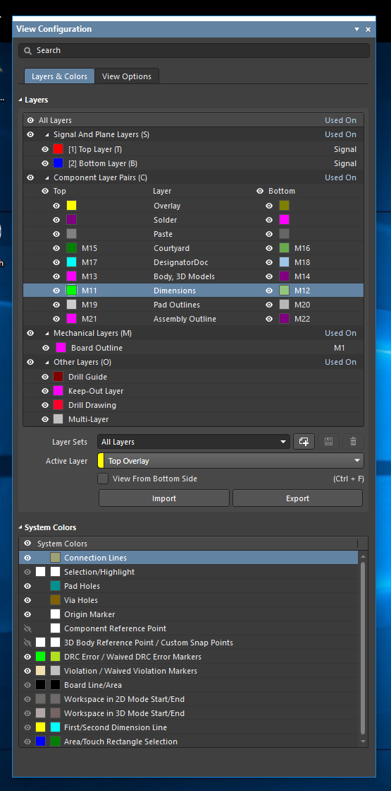

# AltiumLibs
Altium Libraries used for subjects RES, KEN and my personal projects

# Layer usage

Layers in the PCB libraries are for the most part used just like in components created by the altium wizards, but there are a few layers added to ease documentation creation. 

Ideally you would have layers organized as shown in the picture below. Layer configuration is not stored in the library - the user has to create his own. Unfortunately, not all the components are updated yet (some remain unchanged since the time they were imported form the P-CAD libraries).

